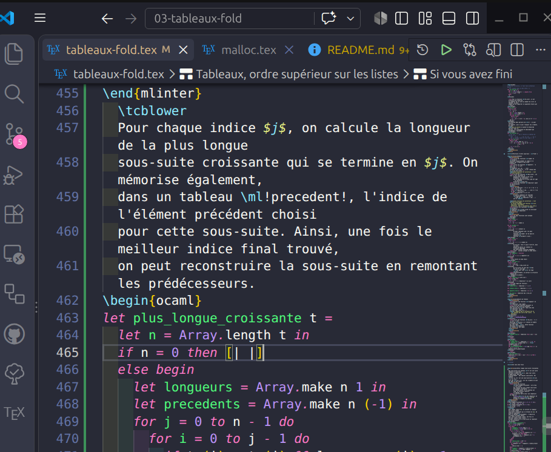
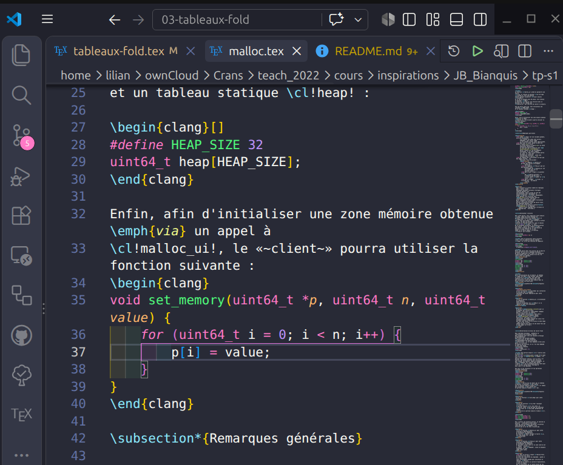

# VSCode local package to color OCaml and C code blocks in LaTeX

A tiny local VSCode/Codium package, to add syntax coloration for OCaml / C code blocks, when editing files written with the LaTeX typesetting system.

Written in half-an-hour an afternoon, just for fun.
I [got helped](https://gemini.google.com) and [also helped](https://copilot.github.com).

## Demonstration





---

## Installation

```bash
cd ~/.vscode/extensions/
git clone https://github.com/Naereen/VSCode-local-package-to-color-OCaml-and-C-code-blocks-in-LaTeX.git
mv VSCode-local-package-to-color-OCaml-and-C-code-blocks-in-LaTeX local.latex-ocaml-syntax-0.0.1
```

Then restart your VSCode window.

## Usage

When editing a LaTeX file, OCaml and C code blocks will be automatically colorized according to their respective syntax.

Warning: the "OCaml Platform" extension for VSCode have to be installed, otherwise the OCaml code blocks will not be properly colorized.

---

## :scroll: Licence ? [](https://github.com/Naereen/Comparing-a-buy-list-and-a-scanned-list-Magic-the-Gathering/blob/master/LICENSE)

[Licence MIT](https://lbesson.mit-license.org/) (fichier [LICENSE](LICENSE)).
© [Lilian Besson](https://GitHub.com/Naereen), Sept. 2026.

[](https://GitHub.com/Naereen/Comparing-a-buy-list-and-a-scanned-list-Magic-the-Gathering/graphs/commit-activity)
[](https://GitHub.com/Naereen/ama)
[](http://ForTheBadge.com)
[](https://GitHub.com/)
[](http://ForTheBadge.com)
[](http://ForTheBadge.com)
[](http://ForTheBadge.com)

